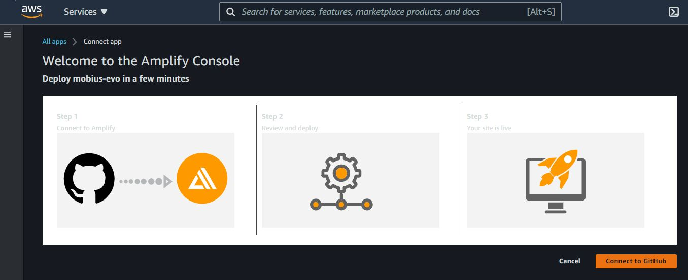
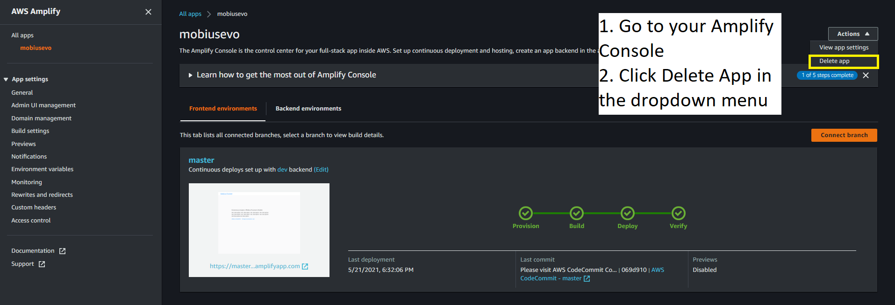

# Mobius Evolver
Cloud-based Evolutionary Optimisation for Mobius Modeller.

Example runs using Mobius Evolver:
* [Example 1](https://master.d3i0dy0fnq65q5.amplifyapp.com/view-searches/search-results#id=e5fbecee-ca9c-4e13-80dc-8da949424969)
* [Example 2](https://master.d3i0dy0fnq65q5.amplifyapp.com/view-searches/search-results#id=111ade96-4e7b-4ad5-8bac-cf63dc87c89c)

## Requirements
Mobius Evolver has been built on the Amazon AWS cloud computing platform.

The instructions below will explain how to install Mobius Evolver on your own AWS Account. 
Before you start, you will require:
* a [Github account](https://github.com/join)
* an [Amazon AWS account](https://portal.aws.amazon.com/billing/signup)

### Amazon AWS Cloud Computing
With your AWS account (May 2021):
* you get a free DynamoDB quota every month: 25GB of free storage,
* you get a free Lambda quota every month: 1 million function invocations and 3.2 million seconds (37 days) of computing time, and
* for the the first 12 months after opening your account, you get 5GB of free storage on S3.

This means that you can run large numbers such searches every month without incurring any Lambda costs. You may still incur some storage costs depending on how long you save the results, but these costs are low. (May 2021, S3 storage cost is $0.023 / GB).

* For more information on the AWS free tier, see [https://aws.amazon.com/free/](https://aws.amazon.com/free/)
* For more information of AWS S3 storage costs, see [https://aws.amazon.com/s3/pricing/](https://aws.amazon.com/s3/pricing/)

### Install Mobius Evolver
Installation is very straightforward. In your browser, make sure you are logged into both your GitHub account and your AWS account. Then click this `Install Mobius Evolver` button.

1. This step will create a fork of mobius-evo to your GitHub account
* Click the `Connect to GitHub` button.

2. This step will start the deployment of Mobius Evolver on your AWS account.
* Click `Create new role`, 
* Click `Next` until the new role has been created.
* Click the refresh button just above above the `Create new role` button.
* Select the new role from the drop down list.
* Click the `Save and Deploy` button.

3. The automated setup process takes around 20 minutes. There are four stages: provision, build, deploy, and verify. Once you see a green tick next to each stage, the process has completed.
* Click the URL link at the bottom left. It follows this format:
`https://main.<app id>.amplifyapp.com`
* Your personal version of Mobius Evolver will open up in the browser.

4. You can now log out of your GitHub and AWS account. You can continue to use Mobius Evolver.

## Uninstall Mobius Evolver
1. Log into your AWS account, the AWS Console will be visible. 

2. Find your Mobius Evolver app in the Console.
* In the search bar at the top of the AWS Console, type `Amplify` 
* Click `AWS Amplify` link that pops up.

3. Delete the app.
* A page displaying all your apps opens up. Click on the `mobiusevo` app.
* In the top right hand corner, click `Action` and select `Delete App`.
* Follow the app deletion steps in AWS Console.

4. Find your Cognito User Pool in the Console.
* In the search bar at the top of the AWS Console, type `Cognito` 
* Click the `Cognito` link that pops up.

5. Delete the user pool.
* Click `Mange User Pools`
* Select the user pool for Mobius Evolver. It follows this format: `amplify_backend_manager_<app id>`
* Click `Delete Pool` in the top right hand corner.
